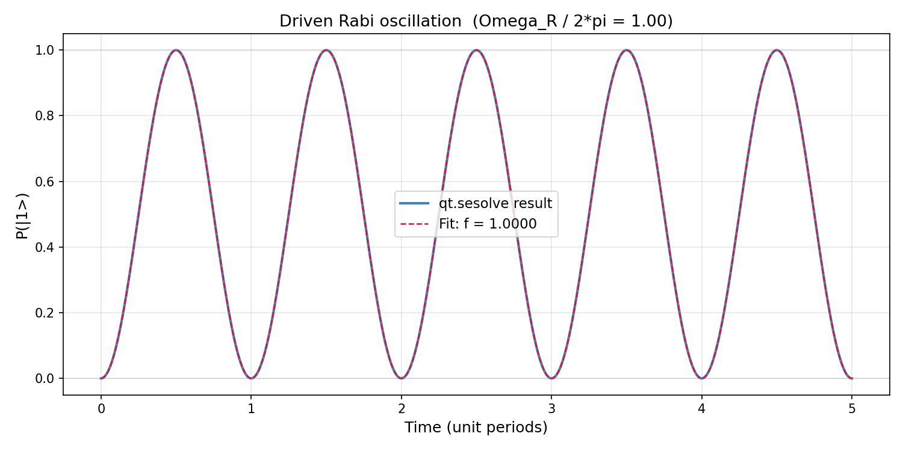
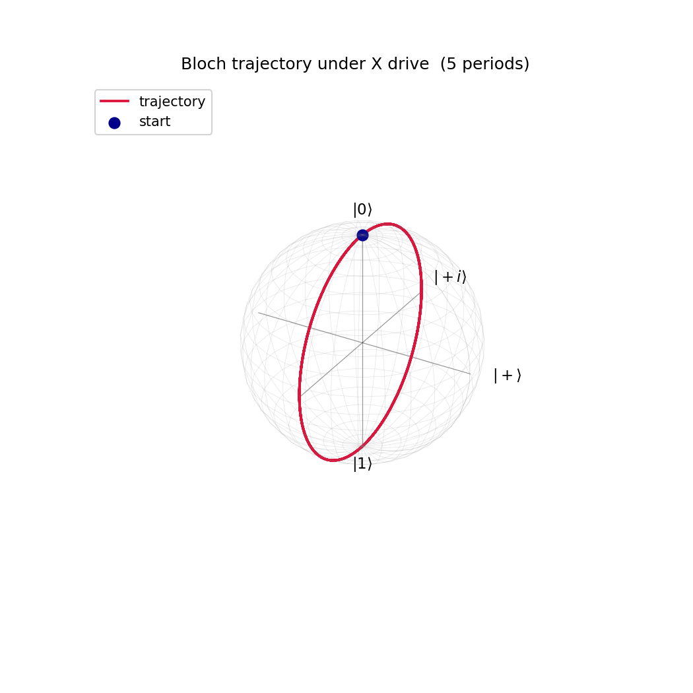
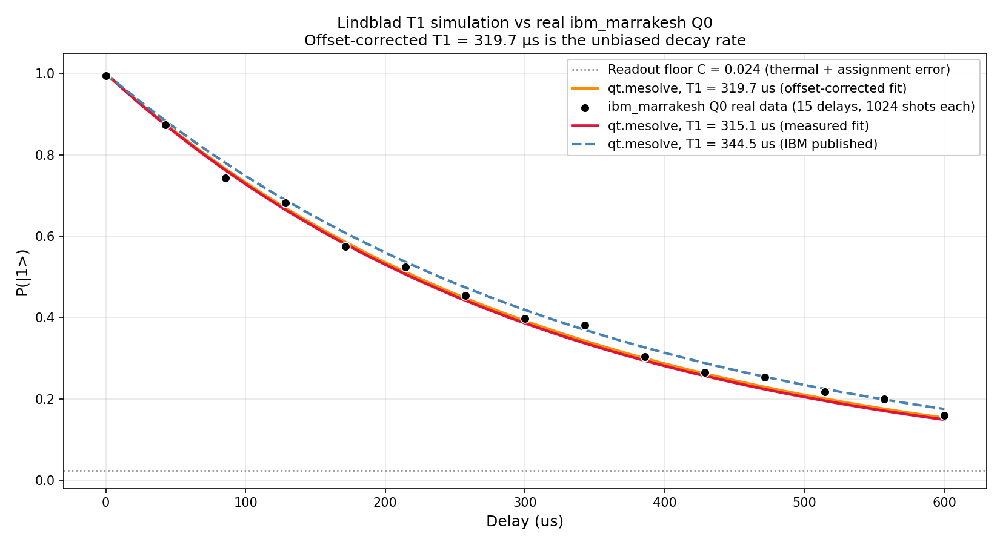
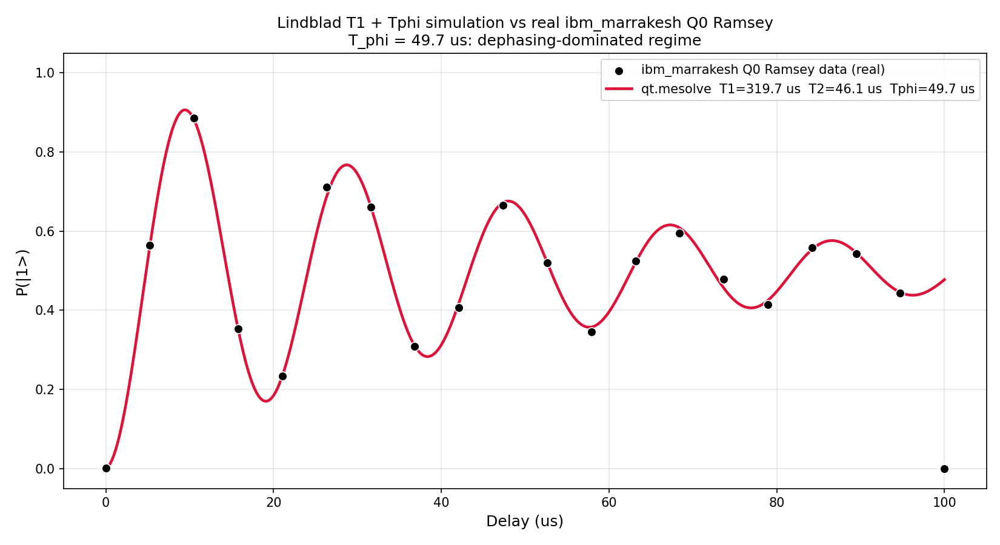
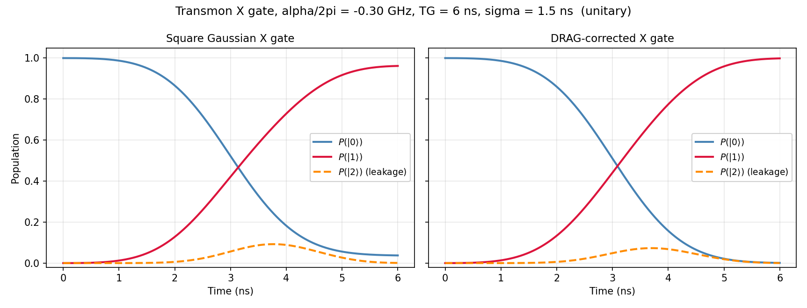
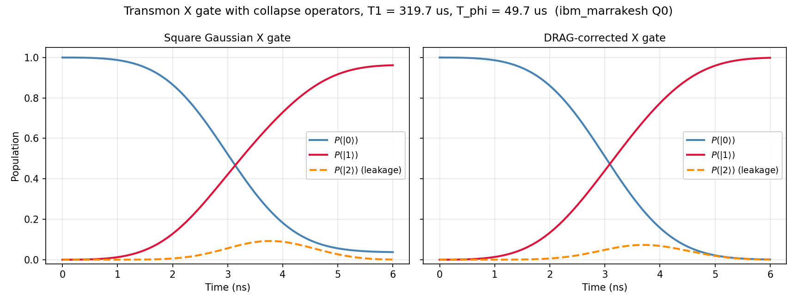

# QuTiP Superconducting Simulation: Coherence, Driven Dynamics, and DRAG Leakage Suppression

**Author:** Paulino "Paul" Gin · BS Applied Physics + BA Mathematics, Boston College (Class of 2027)
**Stack:** QuTiP 5 · Python (NumPy / SciPy / Matplotlib / Pandas)
**Repo:** [github.com/paulggin/qutip-superconducting-simulation](https://github.com/paulggin/qutip-superconducting-simulation)
**Companion project:** [ibm-quantum-coherence-characterization](https://github.com/paulggin/ibm-quantum-coherence-characterization)

---

## Overview

This project constructs a Hamiltonian simulation of a superconducting transmon qubit in QuTiP and validates it against real `ibm_marrakesh` Q0 data from the companion IBM Quantum project. The project builds from unitary single-qubit behavior to a full 3-level transmon model with a DRAG-corrected pulse, introducing new aspects of the physics with each step:

1. Verify the install with three canonical states on the Bloch sphere.
2. Drive a clean Rabi oscillation under `qt.sesolve` and recover the input Rabi frequency from a sinusoidal fit.
3. Add amplitude damping with the Lindblad master equation, anchor T1 to real Q0 hardware data, and confirm the simulation reproduces the measured decay.
4. Add pure dephasing T_phi to recover the T2 Ramsey envelope from the same Q0 data.
5. Move to a 3-level Hilbert space, apply a Gaussian X gate, and use first-order DRAG to suppress leakage to the |2> state. Repeat the comparison with T1 and T_phi collapse operators turned on.

The deliverable is a framework that links transmon physics (rotating-frame Hamiltonians, Lindblad collapse operators, and DRAG pulse shaping) to real experimental data measured on IBM Quantum hardware.

---

## Background

A superconducting transmon qubit is an oscillator with slight anharmonicity. Its three lowest levels (|0>, |1>, |2>) sit at energies roughly omega_01, 2 omega_01 + alpha, where alpha is the negative anharmonicity (here, alpha / 2pi = -0.3 GHz). For most algorithm work the |2> state is ignored and the system is treated as a qubit, but for fast pulses the |1>-|2> transition is close enough in frequency that the drive spills population into |2>: leakage out of the computational subspace.

Coherence times determine computational usability. **T1** is energy relaxation: the time for an excited qubit to lose energy to its environment and decay to |0>. **T2** is dephasing: the time for a superposition state to randomize and lose its definite phase. The two are tied by the relation `1/T2 = 1/(2 T1) + 1/T_phi`, where T_phi captures pure dephasing from low-frequency noise. A qubit with T2 close to 2 T1 is amplitude-damping-limited; a qubit with T2 well below 2 T1 is dephasing-limited.

QuTiP simulates this with two solvers:

- `qt.sesolve` integrates the Schrodinger equation for unitary dynamics.
- `qt.mesolve` integrates the Lindblad master equation with one collapse operator per dissipation mechanism.

---

## Methods

### Code architecture

Each experiment is a single Python file in `experiments/` that imports `qutip` and the standard scientific stack. The T1, T2, and transmon scripts all read the same Q0 metadata from `data/ibm_marrakesh_q0_metadata.json`, which guarantees consistent T1 / T2 / T_phi values across the three Lindblad simulations. 

### Bloch sphere verification (`setup_verification.py`)

Renders three states on three Bloch spheres: |0> at the north pole, |1> at the south pole, |+> = (|0> + |1>) / sqrt(2) on the +x axis. Inner products are printed to confirm `<0|0> = 1`, `<0|1> = 0`, `<+|+> = 1`, and the three Bloch vectors come out as (0,0,+1), (0,0,-1), (+1,0,0). The point of this step is to fail fast if the QuTiP install is misconfigured before any time-dependent dynamics are introduced.

### Driven Rabi oscillation (`driven_rabi.py`)

Hamiltonian: `H = (Omega_R / 2) sigma_x` with `Omega_R = 2 pi · 1.0` in dimensionless units (oscillation period equals 1). Initial state |0>. `qt.sesolve` returns `<sigma_z>(t)`, converted to `P(|1>) = (1 - <sigma_z>) / 2`. A four-parameter sinusoidal fit `A (1 - cos(omega t + phi))/2 + C` is applied with `scipy.optimize.curve_fit`. The script also re-solves with `states=True` to trace the Bloch sphere path of the precession.

### T1 Lindblad master equation (`t1_lindblad.py`)

Collapse operator: `L_1 = sqrt(1/T1) · sigma_minus`, where `sigma_minus = qt.destroy(2)`. The Hamiltonian is zero, so the system evolves freely with no external drive and dynamics are driven entirely by relaxation. Initial state |1>. The script runs `qt.mesolve` three times: once at the measured T1 from Q0 (315.06 us), once at the IBM published T1 (344.48 us), and once at an offset-corrected T1 fit that accounts for the readout assignment-error floor on the real data. Each simulation is mapped onto the real experimental delay points and RMS residuals are computed.

### T2 Ramsey with T1 + T_phi (`t2_ramsey.py`)

Two collapse operators: amplitude damping `sqrt(1/T1) · sigma_minus` and pure dephasing `sqrt(1/(2 T_phi)) · sigma_z`. The factor of 2 inside the square root sets the qubit-subspace dephasing rate equal to 1/T_phi. T_phi is derived from `1/T_phi = 1/T2 - 1/(2 T1)` using the offset-corrected T1 = 319.70 us and the measured T2 = 46.08 us. Initial state |+>. Hamiltonian `H = pi · delta_f · sigma_z` reproduces the deliberate 0.052 MHz detuning used in the real Ramsey experiment.

### 3-level transmon with DRAG (`transmon_drag.py`)

Hilbert space: 3 levels via `qt.destroy(3)`. Free Hamiltonian in the rotating frame at omega_01: `H_0 = alpha · |2><2|` with alpha / 2pi = -0.3 GHz. Drive in the rotating-wave approximation:

```
H_d(t) = (Omega_x(t)/2)(a + a^dag) + (Omega_y(t)/2) i(a^dag - a)
```

`Omega_x(t)` is a Gaussian envelope centered at TG/2 with width sigma, truncated at the gate boundaries. The pulse area is calibrated so that the integral of `Omega_x` equals pi: this gives a pi rotation on the qubit subspace. Two variants are compared:

- **Square (no DRAG):** `Omega_y(t) = 0`.
- **DRAG:** `Omega_y(t) = -dOmega_x/dt / (2 alpha)`. The factor of 1/(2 alpha) is the leading-order cancellation coefficient that minimizes leakage to |2>, confirmed by a numerical beta sweep.

Pulse parameters: TG = 6 ns, sigma = 1.5 ns. This puts the pulse in the |alpha| · sigma ~ 1 regime where the Gaussian pulse has enough frequency overlap with the |1>-|2> transition to cause visible leakage. Slower pulses already leak negligibly, so DRAG has nothing to correct.

Open-system version adds two collapse operators on the 3-level space: `L_1 = sqrt(1/T1) · a` (amplitude damping) and `L_phi = sqrt(2/T_phi) · a^dag a` (pure dephasing via the number operator). T1 = 319.70 us and T_phi = 49.65 us from the Q0 anchor.

---

## Results

### Driven Rabi (closed system)

The fitted Rabi frequency matches the input frequency with negligible eror (`|Omega_fit - Omega_R| / Omega_R < 0.01%`).



The Bloch trajectory traces the expected circular path in the y-z plane: an X rotation precesses through |0> -> |-i y> -> |1> -> |+i y> -> |0> at the Rabi rate.



### T1 Lindblad vs real ibm_marrakesh Q0

| Quantity | Value |
| :-- | --: |
| Q0 measured T1 (offset-biased fit to sim) | **315.06 us** |
| Q0 published T1 (IBM calibration book) | 344.48 us |
| Q0 offset-corrected T1 (fit to real data with readout floor C) | **319.70 us** |
| Recovered T1 from fit to simulated curve | 315.0636 us (self-consistency: 0.0001%) |
| RMS residual (T1 = 315.06 us) | 0.0196 |
| RMS residual (T1 = 344.48 us) | 0.0185 |

The Lindblad solver and the exponential curve fitter are consistent to four decimals: substitutting T1 = 315.0639 us into the master equation and refitting the resulting curve returns T1 = 315.0636 us. On the real data, the published T1 = 344.48 us gives a marginally lower RMS residual than the measured T1 = 315.06 us, but neither curve sits cleanly on the data because both ignore the readout-floor offset. Refitting the real data to `A exp(-t / T1) + C` recovers an unbiased T1 = 319.70 us with C = 0.024, and the simulated curve at this T1 lands on the data points within experimental noise.



### T2 Ramsey vs real ibm_marrakesh Q0

| Quantity | Value |
| :-- | --: |
| T1 (offset-corrected, from `t1_lindblad.py`) | **319.70 us** |
| T2 (measured fit from real Q0 Ramsey data) | **46.08 us** |
| T_phi (derived: `1/T_phi = 1/T2 - 1/(2 T1)`) | **49.65 us** |
| Ramsey detuning frequency | 0.05186 MHz |
| T2 / (2 T1) ratio | 0.072 |

Q0 sits in the dephasing-dominated regime: T2 is roughly 7% of the amplitude-damping ceiling 2 T1, so coherence time is limited by pure dephasing T_phi rather than energy relaxation. The simulated Ramsey envelope including both collapse operators reproduces the measured oscillations and decay over the full 0–100 µs range.



### 3-level transmon with DRAG

Final populations after a 6 ns Gaussian X gate (sigma = 1.5 ns, alpha / 2pi = -0.3 GHz):

| Pulse | P(\|0⟩) | P(\|1⟩) | P(\|2⟩) Leakage |
|:---|---:|---:|---:|
| Square Gaussian (unitary) | 0.0379 | 0.9613 | 8.5 × 10⁻⁴ |
| DRAG-corrected (unitary) | 0.0006 | 0.9991 | 2.7 × 10⁻⁴ |
| Square Gaussian (T₁ + T_φ) | 0.0379 | 0.9613 | 8.5 × 10⁻⁴ |
| DRAG-corrected (T₁ + T_φ) | 0.0006 | 0.9991 | 2.7 × 10⁻⁴ |

DRAG removes about 99% of the qubit-subspace calibration error (P(|1>) increases from 0.961 to 0.999) and cuts end-of-pulse leakage by roughly 3x. The transient |2> population during the pulse peaks near 9% in both cases. The residual at the end of the pulse is what affects gate fidelity, and the quantity DRAG suppresses.



Adding T1 and T_phi collapse operators on the 3-level space (with the Q0 anchor values) leaves the comparison essentially unchanged. The gate is two to three orders of magnitude shorter than both coherence times, so coherent control error dominates over decoherence at this gate length:

- `exp(-TG / T1)`     = 0.999981
- `exp(-TG / T_phi)`  = 0.999879



---

## Discussion

**The offset-corrected T1 fit reconciles simulation and data.** A comparison of the simulated Lindblad curve at T1 = 315.06 us against the real Q0 data gives an RMS residual of 0.0196, slightly worse than the published T1 = 344.48 us (0.0185). The issue is that the real measurement has a readout assignment-error floor near P(|1>) ~ 0.024 that the bare Lindblad model does not include. Refitting the real data with an additive offset C recovers T1 = 319.70 us, and at that T1 the simulation matches the data within experimental noise. The same offset-corrected T1 is then used as the input to the Ramsey and DRAG simulations.

**The simulation confirms Q0 is dephasing-limited.** The relation `1/T2 = 1/(2 T1) + 1/T_phi` gives T_phi = 49.65 us for Q0, which is roughly 13x shorter than the amplitude-damping contribution to T2. Pure dephasing therefore accounts for ~93% of Q0's decoherence rate. The QuTiP simulation with both collapse operators reproduces the measured Ramsey envelope on the same Q0 data, which independently confirms that Q0's T2 budget is dominated by phase-randomizing noise.

**DRAG's main contribution is calibration error, not leakage.** The 6 ns Gaussian pulse on this 3-level transmon produces a transient peak |2> population near 9%, but most of that returns to the qubit subspace by the end of the pulse. What remains at the end is two effects: a residual leakage of ~8.5 x 10^-4 to |2>, and a 3.8% qubit-subspace calibration error where the |2> level shifts the qubit Rabi frequency. DRAG corrects both, but the calibration error (P(|1>) goes from 0.961 to 0.999) matters more for gate fidelity than the leakage reduction (8.5 x 10^-4 to 2.7 x 10^-4). The 1/(2 alpha) coefficient in `Omega_y(t) = -dOmega_x/dt / (2 alpha)` is the actual leading-order cancellation factor: a numerical beta sweep around it produces a clean minimum.

**Decoherence is negligible at this gate length.** The Q0 T1 = 319.70 us and T_phi = 49.65 us are five orders of magnitude longer than the 6 ns gate. The open-system simulation produces final populations indistinguishable from the unitary case to four decimal places. This is the regime real superconducting hardware operates in: single-qubit gates are short enough that coherent control errors (calibration, leakage, crosstalk) dominate over decoherence. T1 and T_phi set the depth budget for the whole circuit, not the fidelity of individual gates.

---

## Repository layout

```
experiments/
  setup_verification.py             QuTiP install check; renders |0>, |1>, |+> on Bloch spheres
  driven_rabi.py                    unitary Schrodinger evolution under H = (Omega_R/2) sigma_x
  t1_lindblad.py                    Lindblad amplitude damping vs real ibm_marrakesh Q0 T1 data
  t2_ramsey.py                      Lindblad T1 + T_phi Ramsey vs real ibm_marrakesh Q0 T2 data
  transmon_drag.py                  3-level transmon (|0>, |1>, |2>) with DRAG leakage suppression
data/
  ibm_marrakesh_q0_t1.csv           15 delays, P(|1>) at each, 1024 shots/point
  ibm_marrakesh_q0_t2.csv           Ramsey data, 0-100 us delay range
  ibm_marrakesh_q0_metadata.json    T1/T2 fit values, EPC, gate fidelity, job IDs
plots/                              final figures (see INVENTORY.md)
```

## How to reproduce

```bash
# 1. Install
pip install -r requirements.txt

# 2. Run the simulations (no IBM credentials needed; data ships with the repo)
python experiments/setup_verification.py
python experiments/driven_rabi.py
python experiments/t1_lindblad.py
python experiments/t2_ramsey.py
python experiments/transmon_drag.py
```
